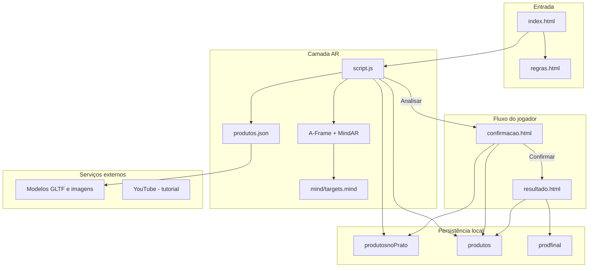
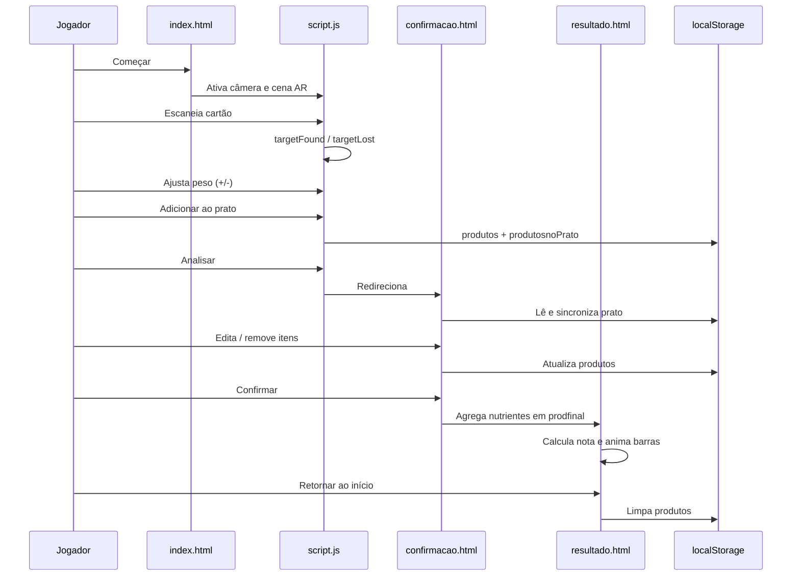

# Prato Feito

Aplicação web educativa para montagem de um prato alimentar com realidade aumentada (AR), ajuste de porções e avaliação nutricional gamificada. O jogador utiliza cartões físicos impressos, escaneados pela câmera do dispositivo, para visualizar alimentos em 3D e compor uma refeição.

---

## Visão geral

O sistema é uma SPA estática composta por múltiplas páginas HTML interligadas. Não há backend, build step nem framework de aplicação. A persistência entre telas é feita exclusivamente via `localStorage` do navegador.

| Aspecto | Detalhe |
|---|---|
| Linguagem | HTML, CSS, JavaScript (ES6+) |
| Renderização 3D / AR | A-Frame 1.5.0 + MindAR 1.2.5 |
| Catálogo de alimentos | `produtos.json` (19 itens) |
| Alvos de rastreamento | `mind/targets.mind` (arquivo de imagem MindAR) |
| Modelos 3D e fotos | Hospedados em CDN externo (Cloudflare Pages) |
| Persistência | `localStorage` |

---

## Estrutura do repositório

```
PratoFeito/
├── index.html                 # Tela inicial e experiência AR principal
├── script.js                  # Lógica central: AR, prato, modais, persistência
├── produtos.json              # Catálogo nutricional e referências de modelos 3D
├── 404.html                   # Página de erro
├── LICENSE                    # Licença do software
├── README.md
│
├── css/
│   ├── inicio.css             # Estilos da tela inicial
│   ├── style.css              # Estilos da interface AR (controles, modal)
│   ├── confirmacao.css        # Estilos da tela de confirmação
│   ├── resultado.css          # Estilos da tela de resultado
│   └── regras.css             # Estilos da tela de regras
│
├── scripts/
│   ├── full-screen.js         # Navegação, fullscreen e utilitários de fluxo
│   ├── confirmação.js         # Listagem e edição do prato na confirmação
│   ├── resultado.js           # Agregação nutricional pré-resultado
│   ├── criacaodoalimento.js   # Renderização dos cards de alimentos no resultado
│   └── alterarSetas.js        # Cálculo de nota e animação das barras
│
├── resources/
│   ├── regras.html            # Tutorial e regras do jogo
│   ├── confirmacao.html       # Revisão do prato antes da análise
│   └── resultado.html         # Nota final e barras de nutrientes
│
├── img/                       # Assets visuais locais (logo, ícones, GIF de orientação)
└── mind/
    └── targets.mind           # Banco de alvos de imagem para o MindAR
```

**Nota:** `img/` e `mind/` são referenciados pelo código, mas podem não estar versionados neste repositório. São necessários para execução completa da experiência AR.

---

## Arquitetura



---

## Fluxo de telas



### 1. Tela inicial (`index.html`)

- Exibe logo e botões **Como jogar** e **Começar**.
- **Começar** ativa tela cheia e exibe a cena AR (`#trocarblock`).
- Contém a cena A-Frame com MindAR configurado para até 10 alvos simultâneos.

### 2. Experiência AR (`script.js`)

Responsável por:

- Carregar `produtos.json` e instanciar entidades 3D dinamicamente.
- Escutar eventos `targetFound` e `targetLost` do MindAR.
- Manter estado em memória do alimento ativo e dos alimentos detectados.
- Ajustar peso, escala 3D e valores nutricionais proporcionalmente.
- Adicionar itens ao prato e redirecionar para confirmação.

### 3. Confirmação (`resources/confirmacao.html` + `scripts/confirmação.js`)

- Lista alimentos do prato com foto, categoria e peso.
- Permite aumentar/diminuir peso em incrementos de 10 g (10–990 g).
- Permite remover itens (mínimo de 1 item no prato).
- Botões **Voltar ao prato** e **Confirmar**.

### 4. Resultado (`resources/resultado.html` + `scripts/resultado.js`, `criacaodoalimento.js`, `alterarSetas.js`)

- Exibe nota de 0 a 100.
- Lista alimentos do prato.
- Mostra barras de proteínas, carboidratos, fibras, calorias, gorduras e sódio.
- Anima ponteiros e contagem da nota ao carregar.

### 5. Regras (`resources/regras.html`)

- Documentação interativa do jogo para o jogador.
- Inclui link para impressão dos cartões e vídeo explicativo.

---

## Módulos e responsabilidades

| Arquivo | Escopo | Responsabilidade |
|---|---|---|
| `script.js` | `index.html` | Núcleo da aplicação AR: detecção, estado, UI do alimento ativo, prato, modais |
| `scripts/full-screen.js` | Multi-página | Fullscreen, rotas entre telas, limpeza de sessão (`finalizar`) |
| `scripts/confirmação.js` | Confirmação | Carregar prato, CRUD visual de itens, recálculo nutricional por peso |
| `scripts/resultado.js` | Confirmação | Função `telafinal()`: soma nutrientes e normaliza contra referências diárias |
| `scripts/criacaodoalimento.js` | Resultado | Gera cards de alimentos a partir de `localStorage` |
| `scripts/alterarSetas.js` | Resultado | Algoritmo de nota, posicionamento dos ponteiros e animação |

---

## Estado em memória (`script.js`)

| Variável | Tipo | Descrição |
|---|---|---|
| `produtos` | `Array` | Catálogo base carregado de `produtos.json` |
| `modelosDetectados` | `Array` | Alimentos já escaneados na sessão (cópias mutáveis) |
| `modelosAtivos` | `Array` | Alimentos com cartão visível na câmera no momento |
| `produtoAtivo` | `Object \| null` | Alimento em foco (último `targetFound` relevante) |
| `modeloAtivo` | `Entity \| null` | Entidade A-Frame do modelo 3D ativo |
| `produtosnoPrato` | `Array` | Prato montado pelo jogador (cópias independentes) |

### Ciclo de detecção AR

1. **`targetFound`**: cria ou recupera cópia do produto em `modelosDetectados` e `modelosAtivos`; define `produtoAtivo` e atualiza painel.
2. **`targetLost`**: remove o item de `modelosAtivos`; limpa painel se era o alimento ativo.
3. **`mais()` / `menos()`**: alteram peso em 10 g via `atualizarProduto()`, recalculam nutrientes proporcionalmente e sincronizam escala 3D.

### Adição ao prato (`AdicionarAlimento`)

- Exige `produtoAtivo` (cartão escaneado).
- Armazena **cópia** do objeto (`JSON.parse(JSON.stringify(...))`) para desacoplar o prato do estado AR.
- Três cenários de feedback via modal:
  - Novo item adicionado.
  - Item já presente com mesmo peso.
  - Peso alterado em relação ao registrado no prato.
- Persiste via `salvarPratoNoStorage()`.

### Análise (`salvar`)

- Valida se `produtosnoPrato` possui ao menos um item.
- Redireciona para `confirmacao.html` (dados já persistidos pelas adições anteriores).

---

## Persistência (`localStorage`)

| Chave | Escrita | Leitura | Conteúdo |
|---|---|---|---|
| `produtosnoPrato` | `script.js`, `confirmação.js` | `script.js`, `confirmação.js` | Array de alimentos adicionados ao prato |
| `produtos` | `script.js`, `confirmação.js` | `confirmação.js`, `resultado.js`, `criacaodoalimento.js` | Espelho sincronizado do prato para telas posteriores |
| `prodfinal` | `resultado.js` (`telafinal`) | `alterarSetas.js` | Totais nutricionais normalizados para exibição |

### Sincronização

As chaves `produtos` e `produtosnoPrato` são mantidas em paralelo por `salvarPratoNoStorage()` e `salvarPrato()`. Na confirmação, ambas são mescladas por `id` na carga inicial.

### Limpeza de sessão

`finalizar()` (tela de resultado) remove `produtos` e `produtosnoPrato`, reiniciando o ciclo.

---

## Modelo de dados (`produtos.json`)

Cada alimento possui a seguinte estrutura:

```json
{
  "id": 0,
  "nome": "Tomate",
  "modelo": "https://.../scene.gltf",
  "foto": "https://.../tomate.webp",
  "peso": 100,
  "categoria": "Fibra",
  "valor_energetico": 15,
  "proteinas": 1.1,
  "carboidratos": 3.1,
  "gorduras": 0.2,
  "fibras": 1.2,
  "sodio": 1,
  "escala": { "x": 0.20, "y": 0.20, "z": 0.20 }
}
```

| Campo | Uso |
|---|---|
| `id` | Índice do alvo MindAR (`targetIndex`) e identificador único |
| `modelo` | URL do arquivo GLTF exibido na cena AR |
| `foto` | Imagem 2D nas telas de confirmação e resultado |
| `peso` | Porção base em gramas (padrão: 100 g) |
| `categoria` | Classificação exibida na UI (ex.: Fibra, Proteína) |
| `valor_energetico` … `sodio` | Macronutrientes proporcionais ao peso |
| `escala` | Escala inicial do modelo 3D na cena |

O catálogo contém **19 alimentos**, correspondentes aos **19 cartões físicos** do jogo.

---

## Motor de avaliação nutricional

### Agregação (`telafinal` em `resultado.js`)

Soma peso e nutrientes de todos os itens em `produtos`, depois normaliza cada nutriente contra uma referência de dieta diária de 2000 kcal:

| Nutriente | Divisor (valor diário de referência) |
|---|---|
| Calorias | 2000 |
| Proteínas | 50 g |
| Carboidratos | 300 g |
| Gorduras | 55 g |
| Fibras | 25 g |
| Sódio | 2400 mg |

O resultado normalizado é armazenado em `prodfinal`.

### Nota por nutriente (`calcularnota`)

| Faixa do valor normalizado | Nota |
|---|---|
| 0 – 0,3 | Proporcional de 0 a 100 (abaixo do recomendado) |
| 0,3 – 0,4 | 100 (faixa ideal) |
| 0,4 – 1,0 | Decresce linearmente de 100 a 0 |
| > 1,0 | 0 (acima do recomendado) |

### Nota geral

Média aritmética das notas dos seis nutrientes. Exibida com animação progressiva de 0 a 100, com codificação por cor (vermelho, laranja, verde).

### Barras gráficas (`moverPonteiro`)

Mapeia o valor normalizado para posição percentual em três zonas:

- 0 – 33%: Abaixo do recomendado
- 33 – 66%: Recomendado
- 66 – 100%: Acima do recomendado

---

## Regras do jogo

### Objetivo

Montar um prato com alimentos habituais, respeitando quantidades adequadas para uma refeição nutritiva.

### Cartões

19 cartões físicos, cada um representando um alimento com dados nutricionais.  
[PDF para impressão dos cartões](https://raw.githubusercontent.com/talesgrodolfo-ops/reposiitorioModelos_PratoFeito/refs/heads/main/cardsPraoFeito-Impressao.pdf)

### Passo a passo

1. **Idealização** — Escolher os cartões que comporão o prato.
2. **Início** — Clicar em **Começar** e permitir acesso à câmera.
3. **Montagem** — Escanear cada cartão, ajustar gramas com **+** / **-**, clicar em **Adicionar ao prato** para cada alimento. Repetir para todos os itens desejados. Clicar em **Analisar**.
4. **Confirmação** — Revisar itens e pesos; ajustar se necessário; **Confirmar** ou **Voltar ao prato**.
5. **Resultado** — Visualizar nota (0–100) e barras de nutrientes.

### Vídeo explicativo

https://www.youtube.com/watch?v=nVzyPsrhGxQ

---

## Aviso legal

Este projeto é um jogo educativo. As informações nutricionais e avaliações não substituem orientação de profissional de saúde ou nutricionista. Consulte um especialista para decisões alimentares individuais.

---

## Licença

Este projeto está licensiado sob a licensa MIT. Consulte o arquivo `LICENSE` para mais detalhes.
